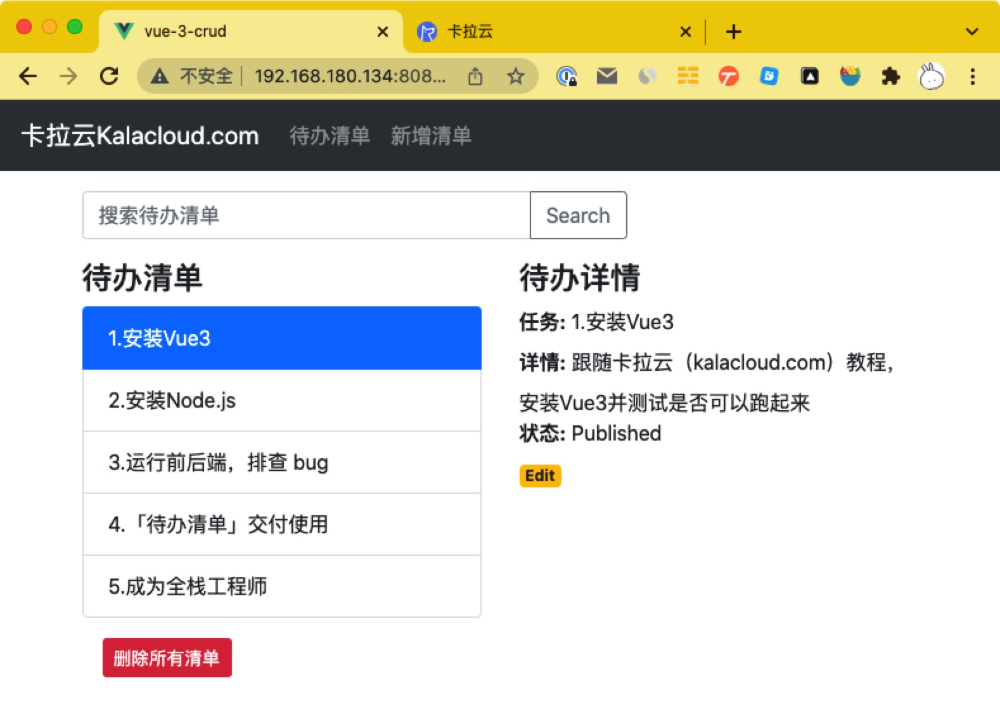

# 全栈实战：手把手教你用Vue3+Node.js+Expres+MySQL开发「待办清单」APP

本教程配套文章请访问卡拉云技术博客：《[手把手教你用Vue3+Node.js+Expres+MySQL开发「待办清单」APP](https://kalacloud.com/blog/vue-js-node-js-express-mysql-crud-example)》

如何才能搭建一套拥有前后端的完整 APP 呢？本文是你成为全栈工程师的入门教程。

我会先教你安装并配置 Vue 3 + Vue Router + axios（前端部分）搭建前端控制页面。然后教你安装配置 node.js + Expres for REST APIs+ MySQL （后端部分），前后端组在一起就是一个完整的 app。

本教程手把手教你搭建一套 「待办清单」app，前端使用 Vue3 ，一共三个页面，首页，todo 列表页，添加删除页；后端使用 node.js + MySQL 搭建。前后端使用 REST API 通讯。读完本教程，你也能写出一个前后端都跑起来，在 PC 端或移动端浏览器上使用的「待办清单」app。

本教程每段代码我都亲手测过，保证百分百没有错误，请打开你的 terminal 跟随本教程一起操作，从这里开始，成为一名全栈工程师。

最后完成的待办清单app如下图，跟随本教学习，你也可以搭出来。

